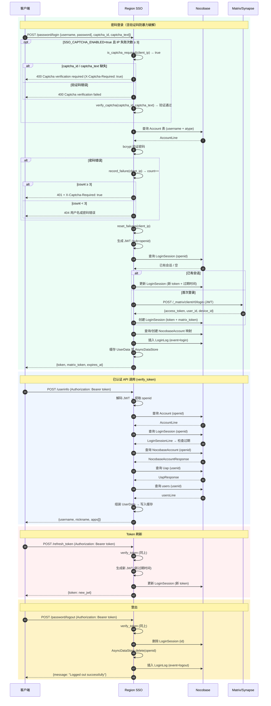
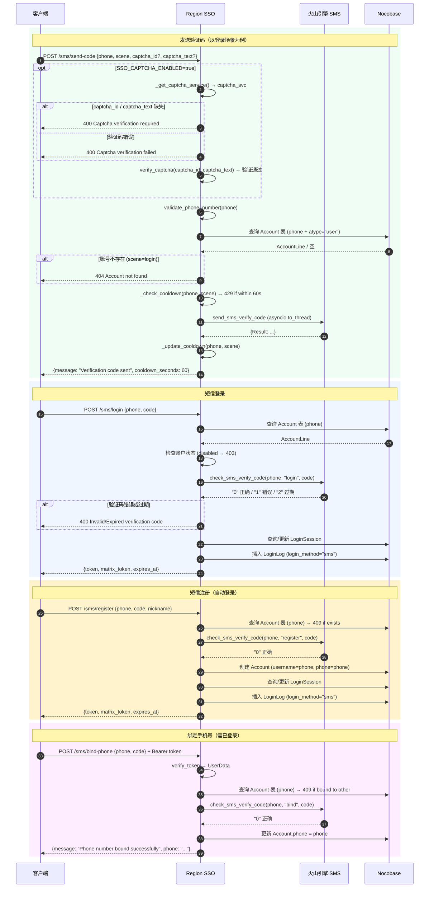
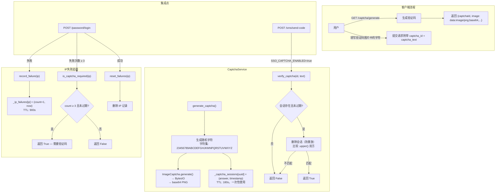

# Region SSO — 系统架构文档

## 目录

- [项目概述](#项目概述)
- [系统架构](#系统架构)
- [核心模块](#核心模块)
- [API 接口文档](ENDPOINTS.md)
- [数据库模型](#数据库模型)
- [认证流程](#认证流程)
- [部署指南](#部署指南)

> API 接口完整文档请参阅 [ENDPOINTS.md](ENDPOINTS.md)。

---

## 项目概述

Region SSO 是一个基于 FastAPI 的单点登录系统，为多个应用提供统一的认证用户中心。系统支持密码登录和微信登录两种认证方式，并深度集成了 Matrix/Synapse 和 Nocobase 两个外部系统。

### 核心功能

| 功能 | 描述 |
|------|------|
| 密码登录 | 基于用户名/密码的本地认证 |
| 微信登录 | 基于 OAuth2 的微信扫码/网页授权登录 |
| 短信验证码登录 | 基于手机号和短信验证码的认证（登录、注册、绑定手机号） |
| JWT Token | 标准化的 Token 颁发、验证和刷新机制 |
| Matrix 集成 | 自动同步用户到 Synapse Matrix 服务 |
| Nocobase 集成 | 多应用用户管理和数据同步 |
| Bot 管理 | 支持机器人账户的创建和登录 |
| 用户配置 | 个性化用户配置存储 |
| 登录日志 | 完整的登录/登出事件记录 |

### 技术栈

| 技术 | 用途 |
|------|------|
| FastAPI | Web 框架 |
| python-jose | JWT Token 编码/解码 |
| matrix-nio | Matrix 客户端库 |
| aiohttp | 异步 HTTP 请求 |
| loguru | 日志记录 |
| bcrypt | 密码哈希 |
| fastapi-sso | OAuth2 SSO 支持 |
| volcengine | 火山引擎短信服务 SDK |
| captcha (lepture) | CAPTCHA 图像生成，用于短信发码保护和密码暴力破解防护 |

---

## 系统架构

### 整体架构图


### 项目目录结构

```
region-sso/
├── app/
│   ├── logger/              # 日志模块
│   │   └── app.py          # Loguru 配置和 HTTPExceptionWithLog
│   │
│   ├── utils/               # 工具模块
│   │   └── config.py        # 配置管理
│   │
│   ├── session/             # 数据库会话模块
│   │   ├── base.py         # BaseMethod (HTTP 操作抽象基类)
│   │   ├── database_session.py  # DatabaseSession (早期版本，已被 oc/Session.py 取代)
│   │   ├── matrix_session.py    # MatrixSession
│   │   ├── session_response.py  # SessionResponse
│   │   └── utils/         # 工具函数
│   │       ├── tool.py      # deserialization, generate_random_str
│   │       └── __init__.py
│   │
│   │   ├── oc/            # Nocobase API 封装
│   │   │   ├── Session.py   # DatabaseSession 扩展
│   │   │   ├── _app.py      # Application 管理模板
│   │   │   ├── Application.py # Nocobase 应用操作
│   │   │   ├── Collections.py # 集合操作
│   │   │   └── table/       # 数据表模型
│   │   │       ├── baseTable.py   # 基础表类
│   │   │       ├── _template.py   # 表模板类
│   │   │       ├── Account.py      # 账户表
│   │   │       ├── WxAccount.py   # 微信账户表
│   │   │       ├── NocobaseAccount.py # Nocobase 账户表
│   │   │       ├── LoginSession.py # 登录会话表
│   │   │       ├── LoginLog.py    # 登录日志表
│   │   │       ├── users.py       # 用户表
│   │   │       ├── Uap.py        # 用户应用权限表
│   │   │       ├── Userconfig.py  # 用户配置表
│   │   │       └── ...          # 其他表模型
│   │   │
│   │   └── matrix/         # Matrix 客户端和管理
│   │       ├── matrix_method.py # Matrix 基础方法
│   │       ├── matrix_admin.py  # 管理员操作
│   │       ├── matrix_client.py # 客户端操作
│   │       ├── admin/          # 管理员 API
│   │       │   ├── register.py      # 注册相关
│   │       │   ├── login.py         # 登录相关
│   │       │   ├── user_check.py    # 用户检查
│   │       │   ├── update_user_info.py # 用户信息更新
│   │       │   ├── username_available.py # 用户名检查
│   │       │   └── generate_nonce.py    # Nonce 生成
│   │       └── client/         # 客客户端 API
│   │           ├── login_password.py   # 密码登录
│   │           ├── logout.py          # 登出
│   │           ├── create_room.py      # 创建房间
│   │           └── ...              # 其他客户端操作
│   │
│   ├── auth/                # 认证核心
│   │   ├── verify_token.py  # Token 验证
│   │   ├── data_store.py    # AsyncDataStore
│   │   ├── login.py        # SSOLogin 登录逻辑
│   │   ├── register.py     # SSORegister 注册逻辑
│   │   └── logout.py      # SSOLogout 登出逻辑
│   │
│   ├── password/            # 密码登录
│   │   └── app.py          # 密码登录路由
│   │
│   ├── captcha/             # CAPTCHA 验证模块
│   │   ├── __init__.py
│   │   ├── service.py       # CaptchaService — 图像生成、会话管理、IP失败追踪
│   │   └── app.py           # CAPTCHA 路由 (GET /captcha/generate)
│   │
│   └── wechat/             # 微信登录
│       ├── app.py          # 微信路由
│       ├── login.py         # 微信登录逻辑
│       └── wechatSSO.py    # WechatSSO 封装
│
│   ├── sms/                # 短信验证
│   │   ├── __init__.py
│   │   ├── service.py      # VolcengineSmsService 封装
│   │   └── app.py          # 短信验证路由
│   │
├── main.py                # 应用入口
├── pyproject.toml         # 项目配置
├── requirements.txt        # 依赖列表
└── .env.example           # 环境变量示例
```

---

## 核心模块

### 1. 配置模块 (`app/utils/config.py`)

`BackendConfig` 类负责初始化应用配置和日志系统。

#### 主要方法

| 方法 | 描述 |
|------|------|
| `load_env(path)` | 加载 .env 环境变量文件 |
| `init_logger()` | 初始化日志系统，创建日志目录 |

#### 日志配置

日志文件位于 `APP_CACHE_PATH/logs/` 目录：

| 文件名 | 级别 | 说明 |
|---------|-------|------|
| app-debug.log | DEBUG | 调试日志 |
| app-info.log | INFO | 信息日志 |
| app-warning.log | WARNING | 警告日志 |
| app-error.log | ERROR | 错误日志 |
| app-critical.log | CRITICAL | 严重错误日志 |

### 2. 数据存储模块 (`app/auth/data_store.py`)

`AsyncDataStore` 是内存数据存储，用于缓存用户会话数据。

#### 数据模型 `UserData`

```python
class UserData:
    market_user_id: Optional[int]      # Market 应用用户 ID
    user: Optional[usersLine]          # 用户基本信息
    account: AccountLine               # 账户信息
    login_session: LoginSessionLine    # 登录会话
    nocobase_accounts: Optional[NocobaseAccountResponse]  # Nocobase 账户列表
    nocobase_account: Optional[dict[str, NocobaseAccountLine]]  # Nocobase 账户字典 {appid: account}
    uaps: Optional[dict[str, UapLine]] # 用户应用权限 {app_id: uap}
    uap_response: Optional[UapResponse]    # UAP 响应数据
```

### 3. Token 验证模块 (`app/auth/verify_token.py`)

提供 JWT Token 的生成、验证和管理功能。

#### 主要函数

| 函数 | 描述 |
|------|------|
| `sso_config()` | 配置 SSO 参数（密钥、算法、过期时间等） |
| `verify_token()` | 验证 JWT Token 并返回用户数据 |
| `Generate_JWToken()` | 生成 JWT Token |
| `Generate_Nocobase_Token()` | 生成 Nocobase 专用 Token |

#### Token 载荷 `JWTokenPayload`

支持两种 Token 格式：

**Matrix OIDC Token:**
```json
{
    "sub": "openid",
    "name": "username",
    "exp": 1735200000,
    "iat": 1735196400,
    "preferred_username": "username"
}
```

**Nocobase Token:**
```json
{
    "userId": 123,
    "iat": 1735196400,
    "exp": 1735197600,
    "signInTime": 1735196400000,
    "jti": "uuid-string",
    "temp": true
}
```

### 4. 登录模块 (`app/auth/login.py`)

`SSOLogin` 类处理登录流程。

#### 主要方法

| 方法 | 描述 |
|------|------|
| `login()` | 通用登录逻辑，生成 Token 和会话 |
| `password()` | 密码登录 |
| `web_wechat()` | 微信网页登录 |
| `bot()` | Bot 登录（有效期10年） |
| `sms()` | 短信验证码登录 |

### 5. 注册模块 (`app/auth/register.py`)

`SSORegister` 类处理用户注册流程。

#### 主要方法

| 方法 | 描述 |
|------|------|
| `register()` | 通用注册逻辑 |
| `password()` | 密码注册 |
| `web_wechat()` | 微信注册 |
| `bot()` | Bot 注册 |
| `sms()` | 短信验证码注册 |
| `check_username_exists()` | 检查用户名是否存在 |

### 6. DatabaseSession (`app/session/oc/Session.py`)

Nocobase 数据库会话类，继承自 `aiohttp.ClientSession`。

#### 表访问方法

| 方法 | 返回值 | 说明 |
|------|--------|------|
| `table_account()` | Account | 账户表 |
| `table_wxaccount()` | WxAccount | 微信账户表 |
| `table_nocobase_account()` | NocobaseAccount | Nocobase 账户表 |
| `table_login_session()` | LoginSession | 登录会话表 |
| `table_login_log()` | LoginLog | 登录日志表 |
| `table_users()` | users | 用户表 |
| `table_uap()` | Uap | 用户应用权限表 |
| `table_userconfig()` | Userconfig | 用户配置表 |
| `table_uapRegistration()` | UapRegistration | UAP 注册表 |
| `table_applist()` | Applist | 应用列表表 |

#### 过滤器函数

| 函数 | 说明 |
|------|------|
| `filter_group_and(list)` | 条件：全部成立 (`$and`) |
| `filter_group_or(list)` | 条件：其一成立 (`$or`) |
| `filter_group_ne(key, value)` | 不包含指定值 (`$ne`) |
| `filter_group_includes(key, value)` | 包含指定值 (`$includes`) |

### 7. MatrixSession (`app/session/matrix_session.py`)

Matrix/Synapse 会话类，继承自 `aiohttp.ClientSession`。

#### 主要方法

| 方法 | 返回值 | 说明 |
|------|--------|------|
| `admin()` | MatrixAdmin | 获取管理员接口 |
| `client()` | MatrixClient | 获取客户端接口 |

#### MatrixAdmin 方法

| 方法 | 描述 |
|------|------|
| `login_generate_nonce()` | 生成注册需要的 nonce |
| `login_register()` | 注册账号 |
| `user_check()` | 检查用户 |
| `username_available()` | 检查用户名是否可用 |
| `update_user_info()` | 更新账号信息 |
| `login()` | 管理员登录（获取用户 token） |

### 8. 短信服务模块 (`app/sms/service.py` 和 `app/sms/app.py`)

`VolcengineSmsService` 是火山引擎短信服务的异步封装，提供验证码发送和校验功能。

#### `VolcengineSmsService` 主要方法

| 方法 | 描述 |
|------|------|
| `send_verify_code(phone, scene, ...)` | 通过火山引擎 SDK 发送短信验证码（使用 `asyncio.to_thread` 异步化） |
| `check_verify_code(phone, scene, code)` | 校验用户提交的验证码，返回 `"0"` 正确 / `"1"` 错误 / `"2"` 已过期 |

#### 冷却机制

- 每个手机号 + 场景组合有 **60 秒**发送冷却（内存级别）
- 冷却期内重复请求返回 HTTP 429，响应体包含剩余等待秒数

#### 手机号格式验证 (`validate_phone_number`)

| 格式 | 规则 | 示例 |
|------|------|------|
| 国内号码 | 11 位，以 `1` 开头 | `13800138000` |
| 国际 E.164 | `+` 前缀，7–15 位数字 | `+8613800138000` |

#### 路由配置 (`app/sms/app.py`)

`sms_config(access_key, secret_key, sms_account, sign, template_id)` 函数在 `configure_sso()` 中调用，初始化模块级 `_sms_service` 单例。路由前缀为 `/sms`，标签为 `sso.sms`。

### 9. CAPTCHA 服务模块 (`app/captcha/`)

`CaptchaService` 提供基于图像的验证码功能，用于保护短信发码端点和密码登录端点免受自动化攻击。

#### 目的

- **短信发码保护**：`POST /sms/send-code` 在 `SSO_CAPTCHA_ENABLED=true` 时强制要求验证码
- **密码暴力破解防护**：`POST /password/login` 在同一 IP 连续失败 3 次后触发验证码

#### `CaptchaService` 主要方法

| 方法 | 描述 |
|------|------|
| `generate_captcha()` | 生成随机验证码图片，存储会话，返回 `{captchaId, image}` |
| `verify_captcha(id, text)` | 验证验证码（一次性使用、大小写不敏感、TTL 检查） |
| `record_failure(ip)` | 记录 IP 登录失败，返回新的失败计数 |
| `is_captcha_required(ip)` | 判断 IP 是否需要验证码（失败次数 ≥ 阈值且在 TTL 内） |
| `reset_failures(ip)` | 重置 IP 的失败计数器（登录成功后调用） |
| `get_failure_count(ip)` | 返回当前失败计数（过期或不存在时返回 0） |

#### `get_client_ip()` 辅助函数

优先读取 `X-Forwarded-For` 请求头（取最左侧 IP），回退到 `request.client.host`，适配反向代理部署场景。

#### 模块级单例模式 (`app/captcha/app.py`)

| 函数 | 描述 |
|------|------|
| `captcha_config(...)` | 在 `configure_sso()` 中调用，初始化模块级 `_captcha_service` 单例 |
| `_require_captcha_service()` | 返回服务实例，若未配置则抛出 503 |

路由前缀为 `/captcha`，标签为 `sso.captcha`。

#### 会话存储

- **存储方式**：内存字典 `_captcha_sessions: dict[str, tuple[str, float]]`
- **TTL**：180 秒（3 分钟），懒清理
- **一次性使用**：验证时立即删除会话（防重放攻击）
- **键**：UUID v4（`captchaId`）；**值**：`(answer_upper, created_timestamp)`

#### IP 失败追踪

- **存储方式**：内存字典 `_ip_failures: dict[str, tuple[int, float]]`
- **TTL**：900 秒（15 分钟），懒清理
- **阈值**：3 次失败后触发验证码要求
- **重置**：登录成功后立即清零

#### 字符集

```
23456789ABCDEFGHJKMNPQRSTUVWXYZ
```

排除了易混淆字符：`0`（与 `O`）、`1`（与 `I`/`L`）、`O`、`I`、`L`。

#### 启用条件

通过环境变量 `SSO_CAPTCHA_ENABLED=true` 启用，默认关闭（向后兼容）。

---

## 数据库模型

### Account 表 (账户表)

存储 SSO 系统的账户信息。

| 字段 | 类型 | 说明 |
|------|------|------|
| id | BIGINT | 主键 |
| openid | UUID/STRING | 唯一标识符 |
| username | VARCHAR(255) | 用户名 |
| password | VARCHAR(255) | 密码（bcrypt 哈希） |
| phone | VARCHAR(20) | 手机号（唯一） |
| email | VARCHAR(255) | 邮箱 |
| atype | ENUM | 账户类型: user/bot/guest |
| status | ENUM | 状态: active/disabled |
| wx_unionid | VARCHAR(255) | 微信 UnionID |
| matrix_home_server | VARCHAR(255) | Matrix Homeserver |
| userid | BIGINT | 关联 users 表 ID |
| config | JSON | 额外配置 |
| createdAt | DATETIME | 创建时间 |
| updatedAt | DATETIME | 更新时间 |

### WxAccount 表 (微信账户表)

存储微信登录相关的账户信息。

| 字段 | 类型 | 说明 |
|------|------|------|
| id | BIGINT | 主键 |
| openid | UUID | 关联 Account openid |
| wx_openid | VARCHAR(255) | 微信 OpenID |
| wx_unionid | VARCHAR(255) | 微信 UnionID |
| wx_state | VARCHAR(255) | OAuth2 state |
| wx_access_token | VARCHAR(255) | 微信访问令牌 |
| wx_refresh_access_token | VARCHAR(255) | 微信刷新令牌 |
| wx_nickname | VARCHAR(255) | 微信昵称 |
| wx_headimgurl | VARCHAR(500) | 微信头像 URL |

### NocobaseAccount 表 (Nocobase 账户表)

存储各 Nocobase 应用的用户 ID 映射。

| 字段 | 类型 | 说明 |
|------|------|------|
| id | BIGINT | 主键 |
| openid | UUID | 关联 Account openid |
| appid | VARCHAR(255) | Nocobase 应用 ID |
| userid | BIGINT | Nocobase users 表 ID |

### LoginSession 表 (登录会话表)

存储用户登录会话信息。

| 字段 | 类型 | 说明 |
|------|------|------|
| id | BIGINT | 主键 |
| openid | UUID | 关联 Account openid |
| token | TEXT | SSO JWT Token |
| matrix_token | VARCHAR(255) | Matrix 访问令牌 |
| issued_at | DATETIME | 签发时间 |
| expires_at | DATETIME | 过期时间 |
| login_method | VARCHAR(50) | 登录方式: password/weixin/sms/robot_token |
| source | VARCHAR(50) | 来源: web/mobile/other |
| is_revoked | BOOLEAN | 是否已撤销 |

### LoginLog 表 (登录日志表)

记录用户登录/登出事件。

| 字段 | 类型 | 说明 |
|------|------|------|
| id | BIGINT | 主键 |
| openid | UUID | 关联 Account openid |
| event_type | ENUM | 事件类型: login/logout/forced_logout |
| login_method | ENUM | 登录方式: password/qrcode/weixin/oauth/sms/robot_token |
| source | ENUM | 来源: web/mobile/other |
| status | ENUM | 状态: success/failure |
| ip_address | VARCHAR(45) | IP 地址 |
| device_info | VARCHAR(255) | 登录设备信息（UA 或设备型号） |
| login_time | DATETIME | 登录时间 |
| reason | VARCHAR(255) | 原因: admin_action/security_policy/token_revoked |
| config | JSON | 额外配置 |
| createdAt | DATETIME | 创建时间 |
| updatedAt | DATETIME | 更新时间 |

### users 表 (用户表)

Nocobase 基础用户表。

| 字段 | 类型 | 说明 |
|------|------|------|
| id | BIGINT | 主键 |
| username | VARCHAR(255) | 用户名 |
| nickname | VARCHAR(255) | 昵称 |
| owner_user_id | BIGINT | 拥有者 ID（Bot 用） |
| createdAt | DATETIME | 创建时间 |
| updatedAt | DATETIME | 更新时间 |

### Uap 表 (用户应用权限表)

存储用户在各个应用中的权限信息。

| 字段 | 类型 | 说明 |
|------|------|------|
| id | BIGINT | 主键 |
| userid | BIGINT | 关联 users 表 ID |
| app_id | VARCHAR(255) | 应用 ID |
| app_tag | VARCHAR(255) | 应用标签 |
| app_userid | BIGINT | 应用内用户 ID |
| virtual_app | BOOLEAN | 是否为虚拟应用 |
| market_userid | BIGINT | Market 应用用户 ID |

### Userconfig 表 (用户配置表)

存储用户的个性化配置。

| 字段 | 类型 | 说明 |
|------|------|------|
| id | BIGINT | 主键 |
| user_id | BIGINT | 关联 users 表 ID |
| config | JSON | 配置数据 |

---

## 认证流程

### 标准 SSO 交互时序图



### 密码登录流程

```
1. 客户端发送 POST /api/auth/password/login
   ├── 用户名: username
   └── 密码: password

2. 服务器验证凭据
   ├── 查询 Account 表
   ├── 检查账户状态
   └── 验证密码 (bcrypt)

3. 生成登录会话
   ├── 生成 SSO JWT Token
   ├── 调用 Matrix JWT 登录获取 Matrix Token
   └── 保存到 LoginSession 表

4. 同步到各应用
   └── 更新 NocobaseAccount 映射

5. 缓存用户数据
   └── 保存到 AsyncDataStore

6. 记录登录日志
   └── 插入 LoginLog 表

7. 返回响应
   ├── SSO Token
   ├── Matrix Token
   └── 过期时间
```

### 微信登录流程

```
1. 客户端请求 GET /api/auth/wx/login
   └── 服务器返回微信授权 URL

2. 用户在微信扫码/授权

3. 微信回调 GET /api/auth/wx/callback
   ├── 获取 code 和 state
   └── 调用微信 API 获取 access_token 和 openid

4. 检查是否已注册
   ├── 查询 WxAccount 表
   ├── 已注册 → 直接登录
   └── 未注册 → 返回微信用户信息，引导注册

5. 微信注册 POST /api/auth/wx/signUp
   ├── 验证手机号格式
   ├── 创建 Account 记录
   ├── 创建 WxAccount 记录
   └── 调用登录流程

6. 返回 SSO Token
```

### 短信验证码认证流程



### CAPTCHA 验证码服务架构



### Token 验证流程

```
1. 客户端请求带 Authorization: Bearer <token>

2. 服务器验证 JWT
   ├── 解码 Token
   ├── 检查签名
   └── 提取 openid

3. 数据库查询（每次请求均直接查库，缓存读取当前已禁用）
   ├── 查询 Account 表
   ├── 查询 LoginSession 表
   ├── 查询 NocobaseAccount 表
   ├── 查询 Uap 表
   └── 查询 users 表

4. 验证会话状态
   ├── 检查账户状态
   └── 检查 Token 是否过期

5. 写入缓存
   └── AsyncDataStore.set(openid, UserData)

6. 返回用户数据
```

---

## 部署指南

### 环境变量配置

```bash
# 应用配置
APP_ENV=production                    # 运行环境
APP_HOST=0.0.0.0                     # 监听地址
APP_PORT=9001                          # 监听端口（代码默认 9001）
APP_CACHE_PATH=/var/cache/region-sso      # 缓存目录

# SSO 配置
SSO_SECRET_KEY=<强密钥>                 # JWT 加密密钥（必须修改！）
JWT_ALGORITHM=HS256                     # JWT 加密算法
JWT_ACCESS_TOKEN_EXPIRE_DAY=30            # Token 过期天数
SSO_APP=A_SYSTEM_SSO                   # SSO 应用 ID

# Nocobase 配置
DATABASE_URL=http://localhost:13000/
DATABASE_ADMIN_TOKEN=your-admin-token
NOCOAUTH_URL=http://localhost:13000/
NOCOAUTH_TOKEN=your-auth-token

# Matrix/Synapse 配置
SYNAPSE_MATRIX_HOMESERVER=matrix.example.com
SYNAPSE_MATRIX_URL=http://matrix.example.com:8008/
SYNAPSE_MATRIX_ADMIN_TOKEN=your-matrix-admin-token
MATRIX_HOMESERVER_URL=http://matrix.example.com:8008

# 微信登录配置 (可选)
SSO_WECHAT_WEB=false                    # 是否启用微信登录
SSO_WECHAT_WEB_APPID=your-appid
SSO_WECHAT_WEB_APPSECRET=your-secret
SSO_WECHAT_WEB_CALLBACK_REDIRECT_URL=https://your-app.com/login
SSO_WECHAT_WEB_CALLBACK_URL=https://your-sso.com/api/auth/wx/callback

# 短信验证配置 (可选)
SSO_SMS_ENABLED=false                   # 是否启用短信验证码功能
VOLC_SMS_ACCESS_KEY=your-access-key     # 火山引擎 Access Key
VOLC_SMS_SECRET_KEY=your-secret-key     # 火山引擎 Secret Key
VOLC_SMS_ACCOUNT=your-sms-account       # 短信服务账号 ID（SmsAccount）
VOLC_SMS_SIGN=your-sms-sign             # 短信签名
VOLC_SMS_TEMPLATE_ID=ST_xxx             # OTP 模板 ID（格式：ST_xxx）

# CAPTCHA 验证码配置 (可选)
SSO_CAPTCHA_ENABLED=false           # 是否启用 CAPTCHA（默认关闭，向后兼容）
CAPTCHA_SESSION_TTL=180             # 验证码会话有效期（秒，默认3分钟）
CAPTCHA_FAILURE_TTL=900             # IP失败记录有效期（秒，默认15分钟）
CAPTCHA_FAILURE_THRESHOLD=3         # 触发验证码的失败次数阈值（默认3次）
CAPTCHA_WIDTH=200                   # 验证码图片宽度（像素）
CAPTCHA_HEIGHT=70                   # 验证码图片高度（像素）
CAPTCHA_LENGTH=4                    # 验证码字符数

# Market App 配置
MARKET_APP_ID=A_SYSTEM_APPLICATION
```

### 火山引擎短信服务前置条件

启用短信验证码功能（`SSO_SMS_ENABLED=true`）前，需在火山引擎控制台完成以下配置：

1. **开通短信服务**：访问 [https://console.volcengine.com/sms](https://console.volcengine.com/sms) 开通服务
2. **获取 API 凭证（AK/SK）**：访问 [https://console.volcengine.com/iam/keymanage/](https://console.volcengine.com/iam/keymanage/) 创建 Access Key
3. **创建消息组（SmsAccount）**：在短信控制台创建消息组，获取 `SmsAccount` ID
4. **申请短信签名**：提交签名审核，审核通过后填入 `VOLC_SMS_SIGN`
5. **创建 OTP 模板**：选择 `CN_OTP`（国内）或 `I18N_OTP`（国际）类型，模板变量**只能**为 `code`，审核通过后将模板 ID（格式 `ST_xxx`）填入 `VOLC_SMS_TEMPLATE_ID`

### Docker 部署示例

```dockerfile
FROM python:3.12-slim

WORKDIR /app

COPY requirements.txt .
RUN pip install -r requirements.txt

COPY . .

ENV APP_ENV=production
ENV APP_HOST=0.0.0.0
ENV APP_PORT=9001

EXPOSE 9001

CMD ["python", "main.py"]
```

```yaml
# docker-compose.yml
version: '3.8'

services:
  region-sso:
    build: .
    ports:
      - "9001:9001"
    volumes:
      - ./config:/app/config
      - /var/cache/region-sso:/var/cache/region-sso
    environment:
      - APP_ENV=production
      - APP_CACHE_PATH=/var/cache/region-sso
    env_file:
      - .env
    restart: unless-stopped
```

### Nginx 反向代理配置

```nginx
upstream region_sso {
    server 127.0.0.1:9001;
}

server {
    listen 443 ssl http2;
    server_name sso.example.com;

    ssl_certificate /path/to/cert.pem;
    ssl_certificate_key /path/to/key.pem;

    location /api/ {
        proxy_pass http://region_sso;
        proxy_set_header Host $host;
        proxy_set_header X-Real-IP $remote_addr;
        proxy_set_header X-Forwarded-For $proxy_add_x_forwarded_for;
        proxy_set_header X-Forwarded-Proto $scheme;
    }
}
```

### 安全建议

1. **密钥管理**: 在生产环境中务必使用强密钥，建议使用 secrets 管理工具
2. **HTTPS**: 生产环境必须使用 HTTPS
3. **CORS**: 根据实际需求配置 CORS 白名单
4. **Token 过期时间**: 根据安全需求设置合理的过期时间
5. **日志监控**: 定期检查日志文件，发现异常登录尝试
6. **依赖更新**: 定期更新依赖包，修复安全漏洞

---

## 开发说明

### 本地开发

```bash
# 安装依赖
pip install -r requirements.txt

# 配置开发环境
cp .env.example .env
# 编辑 .env 设置 APP_ENV=development

# 运行开发服务器
python main.py
```

### 添加新的登录方式

1. 在 `app/auth/login.py` 中添加新方法
2. 在 `app/auth/register.py` 中添加注册方法（如需要）
3. 创建新的路由模块 `app/<provider>/app.py`
4. 在 `app/app.py` 的 `configure_sso()` 中注册路由

> **参考实现**：`app/sms/` 模块是该模式的完整示例——`SSOLogin.sms()`、`SSORegister.sms()` 以及 `app/sms/app.py` 中的四个端点展示了如何将新登录方式无缝集成到现有认证体系中。

### 添加新的数据表

1. 在 `app/session/oc/table/` 创建新表模型文件
2. 参考 `_template.py` 实现表类
3. 在 `app/session/oc/Session.py` 中添加表访问方法

---

## 许可证

本项目采用 MIT 许可证。
